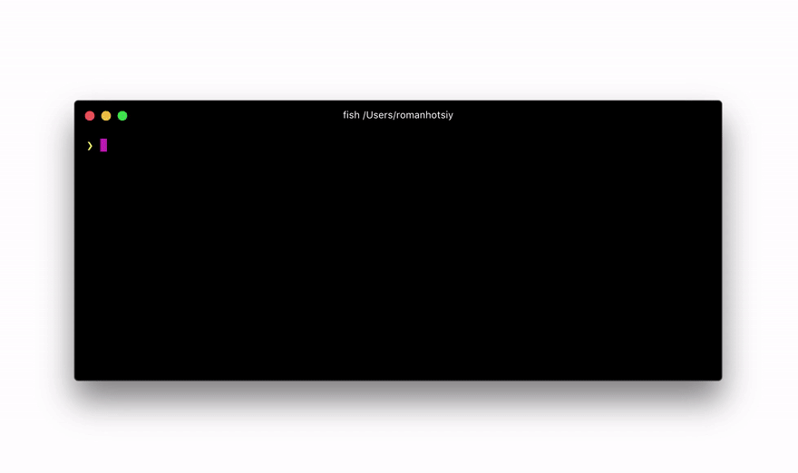

# GraphQL Faker

Mock your future API or extend the existing API with realistic data from [faker.js](https://fakerjs.dev/). **No coding required**.
All you need is to write [GraphQL SDL](https://alligator.io/graphql/graphql-sdl/). Don't worry, we will provide you with examples in our SDL editor.

In the GIF below we add fields to types inside real GitHub API and you can make queries from GraphiQL, Apollo, Relay, etc. and receive **real data mixed with mock data.**


## How does it work?

We use `@fake` directive to let you specify how to fake data. And if 60+ fakers is not enough for you, just use `@examples` directive to provide examples. if you want to fake an exact values, use the `@value` directive. Use `@listLength` directive to specify number of returned array items. Add a directive to any field or custom scalar definition:

    type Person {
      name: String @fake(type: firstName)
      gender: String @examples(values: ["male", "female"])
      pets: [Pet] @listLength(min: 1, max: 10)
    }

Examples how to use exact values by `@value` directive:

    enum PersonalRoles {
          STUDENT,
          MANAGER,
          ADMINISTRATOR
    }

    type PersonRights {
      name: String
    }

    type Person {
      rights: [PersonRights!] @value(values: [{name: "READ"}, {name: "WRITE"}])
      roles: [PersonalRoles] @value(values: ["STUDENT"])
      isActive: Boolean @value(value: true)
      staticToken: String @value(value: "TOKEN")
    }

No need to remember or read any docs. Autocompletion is included!

## Features

- 60+ different types of faked data e.g. `streetAddress`, `firstName`, `lastName`, `imageUrl`, `lorem`, `semver`
- Comes with multiple locales supported
- Runs as a local server (can be called from browser, cURL, your app, etc.)
- Interactive editor with autocompletion for directives with GraphiQL embedded
- ✨ Support for proxying existing GraphQL API and extending it with faked data
  


### Options

- `-p`, `--port` HTTP Port [default: `env.PORT` or `9002`]
- `--feature` Specify to run feature's main graphql
- `--test-case` Specify to run particular test case
- `-e`, `--extend` URL to existing GraphQL server to extend
- `-o`, `--open` Open page with SDL editor and GraphiQL in browser
- `--co`, `--cors-origin` CORS: Specify the custom origin for the Access-Control-Allow-Origin header, by default it is the same as `Origin` header from the request
- `-h`, `--help` Show help


## Example
```
npm run start -- --extend https://stagegateway.goodcreator.co/graphql --feature location --test-case test_case_1
```
# Development

```sh
npm i
npm run build
npm run start
```
